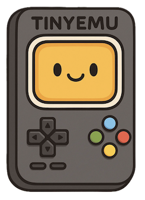

# esp-tiny-emu

<table style="padding:10px">
    <tr>
        <td></td>
        </td>
    </tr>
</table>

## Overview

The ESP-TINY-EMU is a ESP-BOX_EMU-inspired fork that utilizes a small <a href="https://www.waveshare.com/wiki/ESP32-S3-Touch-AMOLED-1.8">Waveshare 1.8 inch AMOLED</a> development system.

More details to come.
